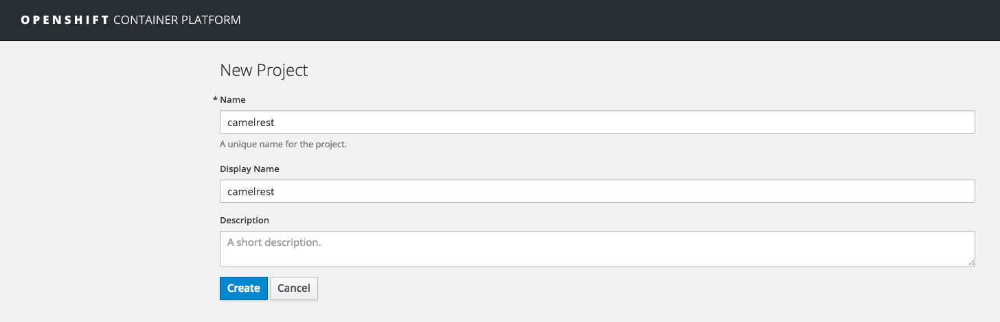
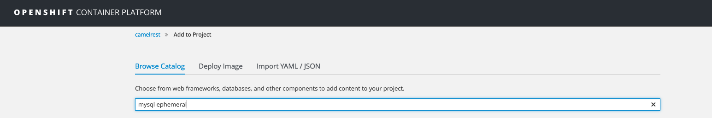
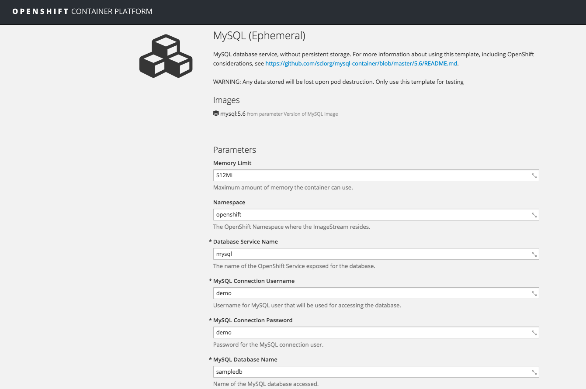
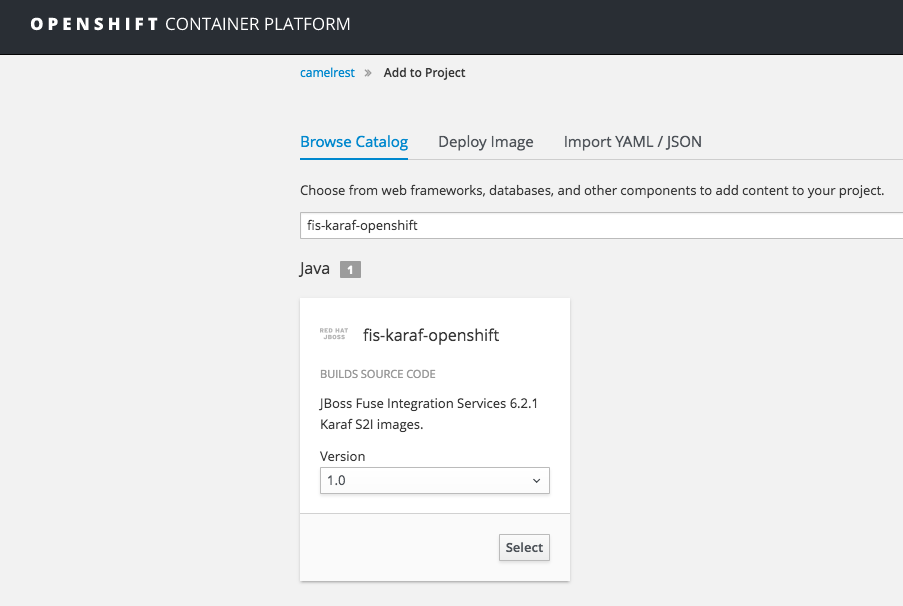
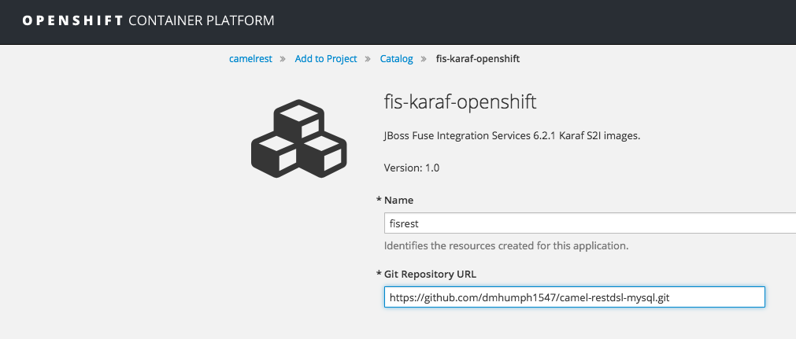
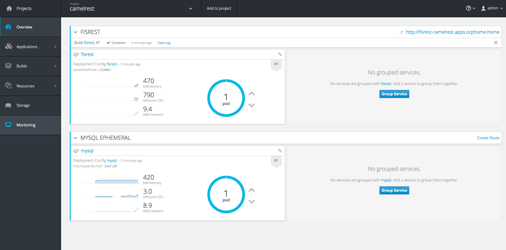

# Karaf Camel Rest DSL and MYSQL on OpenShift

This quickstart demonstrates how to use SQL via JDBC along with Camel's REST DSL to expose a RESTful API.

### Building

First create a new project in OpenShift.

Next you will need to deploy a mysql pod in your new project, which you can do via the web console or via the CLI.

    
### Update application

You will need to fork this gitrepo and update the properties for the 'dataSource' bean in the camel-context.xml with your database serverName (this is the database service), databaseName, user, and password:
	
	<bean class="com.mysql.jdbc.jdbc2.optional.MysqlDataSource" id="dataSource" >
	    <property name="serverName" value="mysql" />
	    <property name="databaseName" value="sampledb" />
	    <property name="port" value="3306" />
	    <property name="user" value="user" />
	    <property name="password" value="password" />
	</bean>

### Deploy application to OpenShift

Now you can deploy your application on OpenShift.  You may either choose to do this via web console or with the CLI.

You will now have a new FIS application deployed with a service and route.  You will need to update the service to point to the proper port (8181 in my example) for the application.  Once you have updated the service you will need to also update the route to point to the updated service.

### Accessing the rest service

When the example is running, a reset service can be accessed to list available books that can be ordered, and as well order status.

The actual endpoint is using context-path `camel-rest-sql/books` and the REST service provides two services

- books = to list all the available books that can be ordered
- order/{id} = to output order status for the given order id. The example will automatic create new orders with a running order id starting from 1.

You can from a web browser then access these services such as:

    http://<openshift_route>/camel-rest-sql/books
    http://<openshift_route>/camel-rest-sql/books/order/1
